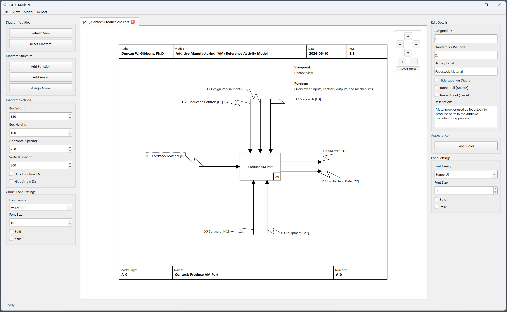

# IDEF0 Modeler
<p align="center">
  
</p>

<p align="center">
  <!-- Python Version (Blue) -->
  <a href="https://www.python.org/downloads/"></a>
  <!-- GUI PyQt6 (Green) -->
  <a href="https://pypi.org/project/PyQt6/"></a>
  <!-- Zenodo DOI (Blue) -->
  <a href="https://doi.org/10.5281/zenodo.YOUR_ZENODO_ID"></a>
  <!-- Code Version (Orange) -->
  <a href="https://github.com/DuncanWilliamGibbons/IDEF0/releases/latest"></a>
  <!-- Last Commit (Bright Green) -->
  <a href="https://github.com/DuncanWilliamGibbons/IDEF0/commits/main"></a>
  <!-- Total Downloads (Purple) -->
  <a href="https://github.com/DuncanWilliamGibbons/IDEF0/releases"></a>
  <!-- Total Page Views (Red) -->
  <a href="https://github.com/DuncanWilliamGibbons/IDEF0"></a>
</p>


The IDEF0 Modeler is a desktop editor for developing Integrated Definition for Function Modeling (IDEF0) models. This program draws, edits, verifies, and exports IDEF0 models, diagrams, and data in accordance with the conformance rules of ISO/IEC/IEEE 31320-1[^1]. This software enables users to import, develop, and export IDEF0 models that comply with this standard for functional modeling. The software has an intuitive GUI for the modeler to edit the model and visualize IDEF0 diagrams and data. 

The IDEF0 modeling language has its roots in the Structured Analysis and Design Technique (SADT). It was developed for the US Air Force and formalized by the NIST FIBS PUB 183 specification in 1993 [^2]. This modeling language and approach are simple and easy to understand by stakeholders, while also enabling the modeling of large and complex functional architectures of systems or enterprises. This can be in the form of software functions, operating processes, or general activities. This language and approach are not as popular as they once were, largely due to the lack of vendor and tool support, model-based and digital formats, and integration or links to other modeling and information formats. This software aims to address these shortcomings by providing a simple GUI to model IDEF0-compliant functional models and architectures, developing an XML-based data format, and the capability to parse the models into other useful formats, such as SysML V2 or JSON files for further development and integrations with other model-based systems engineering (MBSE) tools and systems.

## Table of Contents
- [Description](#idef0-modeler)
- [Features](#features)
- [Installation and Use](#installation-and-use)
- [Code Structure](#code-structure)
- [Data Formats and Exports](#data-formats-and-exports)
- [Examples and Testing](#examples-and-testing)
- [Limitations and Future Work](#limitations-and-future-work)
- [License and Citation](#citation-and-license)
- [References](#references)
## Features

<p align="center">
  
</p>

- **Full IDEF0 syntax** — including function boxes with node numbers and detail references,
  input, control, output, mechanism (ICOM) arrows on all four faces, call arrows, boundary arrows, branches, and
  merges with junction dots, tunnelled arrows, and the A-0 context diagram with
  its purpose and viewpoint statements.
- **Hierarchical decomposition** — double-click a box to open or create its child
  diagram; boundary arrows stay reconciled with the parent in both directions.
- **Automatic layout and routing** — diagonal box placement and orthogonal
  (Manhattan) arrow routing, computed from the model on each diagram. Arrow order
  on each box face, label placement, and trunk nesting each follow the rule that
  minimises arrow overlapping.
- **Both ICOM identities** — the code you assign (`P.2`, `D.4.1`) and
  the positional code the standard defines (`C1`, `O2`) live in separate fields.
- **Light and Dark Mode** - toggle between light and dark mode GUI for improved diagram legibility.
- **Verification report** — 22 criteria from ISO/IEC/IEEE 31320-1 evaluated
  against the model, each detailing how it was decided. Every row is PASS or
  FAIL; additional criteria that require human verification are detailed in
  [docs/IDEF0_VALIDATION_CRITERIA.md](docs/IDEF0_VALIDATION_CRITERIA.md).
- **Model database views** — ICOMs and Functions can be viewed as filterable tables, each with
  an export button that exports this data in CSV, JSON, XML, or TXT formats.
- **Reports** — generate node trees, node indices, and flow reports.
- **Undo, Reset, and Refresh** - functionality to undo up to 5 changes in the project,
  reset the open diagram back to its initial state, or refresh the open diagram to re-run
  the routing and layout logic. Additionally, the Automatically Route Arrows button discards manual
  arrow segments, junctions, and label offsets when re-routing the open diagram.
- **Exports** — seven code and interchange formats (see below), plus diagram export
  to PNG, JPEG, SVG, or PDF.
- **Diagram Customization** - various diagram customization and editorial capabilities, as illustrated in the example figure below.
  Some of which include the ability to change fonts, text sizes, text styles, arrow line thickness, arrow styles, function box fill colors, and function box spacing and sizing.

<p align="center">
  
</p>
  
## Installation and Use
This software requires Python 3.9 or newer (developed and tested on Python 3.13).

The prerequisite libraries required to run this program are: PyQt6

To clone the repo and install the prerequisites:

```bash
git clone https://github.com/<your-account>/idef0-modeler.git
cd idef0-modeler
pip install -r requirements.txt
```

To run the program and launch the GUI:

```bash
python src/main.py
```

The application opens on an empty A-0 context diagram. To open a model
instead, use **File → Open Project**.


### General IDEF0 Modeling Workflow:

1. **Model → Add Function Box** on the A-0 diagram to create the single context
   box, then name it with a verb phrase.
2. **Model → Add Arrow** to model an ICOM arrow and assign it to a function.
   The face an arrow attaches to is its role.
3. **Decompose Function** by double-clicking on the function box. The parent's boundary arrows arrive on
   the child diagram as stubs to be connected to the child's boxes.
4. **Model → Assign Arrow** to assign an already modeled arrow to a function.
5. **Report → Verification Report (ISO 31320-1)** to see what the model does and
   does not yet satisfy.
6. **File → Save Project** writes a `.idefproj` file — the model with its layout.
   
## Code Structure
The codebase is split into two parts: `src/core/` contains the model and its functionality, 
including parsing, layout, routing, conformance checking, and exporting. `src/gui/`
contains the code for the `PyQt6` GUI and widgets.

```
src/main.py              MainWindow - menus, toolbars, undo history, wires GUI to core
│
├── src/core/             
│   ├── model.py             the data model: IDEF0Model, Diagram, ActivityBox,
│   │                        Arrow, ArrowType, Point
│   ├── layout.py            diagonal box placement, Manhattan arrow routing
│   ├── xml_io.py            convert model to and from .idefproj / .idef0 format
│   ├── compliance.py        evaluates the model against the validation criteria
│   ├── export_common.py     resolves the model into an activity tree
│   └── {code,uml,sysml,plantuml,bpmn}_export.py
│                            parses the model and exports to a desired format
│
└── src/gui/                 PyQt6 only
    ├── diagram_scene.py     lays out and routes a diagram from src.core.layout
    ├── diagram_items.py     draws function boxes, arrows, labels, tunnel notation
    ├── management_views.py  ICOMs / Functions / Flow Report tables
    ├── verification_tab.py  runs src.core.compliance and renders the report
    ├── frame_item.py, item_panel.py, properties_panel.py, dialogs.py, theme.py
    │                        frame border, per-item editing panel, settings
    │                        panel, modal dialogs, the dark-mode stylesheet

docs/                     design rationale and export mappings
examples/                 reference models for testing
figures/                  logos and example screenshots
```

## Data Formats and Exports
XML-based file formats were developed to support the import and export of IDEF0 models and full projects. The .idef0 file format contains the functions, ICOMs, and details to repeatably generate the IDEF0 model. 
The .idefproj contains additional data to repeatably generate the model, associated diagrams, and all editorial details. 
The program also had functionality to parse IDEF0 functional models into the new SysML V2 format per the OMG Systems Modeling Language™ (SysML®) Version 2.0[^3].

| Command | Writes | Contains |
| :--- | :--- | :--- |
| **File → Save Project** | `.idefproj` | the model including its diagram plotting data (box positions and sizes, routed arrow segments, junctions, colours, label offsets) |
| **File → Open Project** | reads `.idefproj` or `.idef0` | replaces the open project and reopens at the A-0 diagram |
| **File → Export IDEF0 Model** | `.idef0` | the model excluding its diagram plotting data (boxes, arrows, types, labels, ICOM codes, and attachments only) |
| **File → Import IDEF0 Model** | reads `.idef0` | as above, then lays the model out automatically |
| **File → Export Diagram** | `.png` `.jpg` `.svg` `.pdf` | the active diagram as an image |


The `Export` buttons on the ICOMs database, the Functions database, and each Flow
Report exports this data, including any applied filters, to either CSV, JSON, XML, or TXT formats.

**File → Export Code Architecture** writes the functional architecture as:

| Target | Output | Mapping |
| :--- | :--- | :--- |
| Python | module that runs as it stands | one method per function, signals wired through a per-activity context |
| Java | class that compiles | as above |
| C++ | translation unit that compiles | as above |
| SysML v2 | textual notation | `action def` per function, ICOMs as `in`/`out` item features |
| UML | XMI 2.1 | `uml:Activity` per function, box → `CallBehaviorAction`, arrow → `ObjectFlow` between pins |
| UML | PlantUML activity diagrams | the same mapping, drawn — one page per diagram of the model |
| BPMN | BPMN 2.0 XML | leaf → `bpmn:task`, decomposition → `callActivity`, control/mechanism → `dataObjectReference` |

The code architecture export functionality passes the model through `src/core/export_common.py`, which resolves it
once into an activity tree. Each of these exports the whole project and supplies its own extension if you do not type one.
The IDEF0 specification states that the diagrams do not model functional sequence, so boxes are laid
out in dependency tiers rather than chained into a sequential order. A control is data that governs a function, so it is mapped to an object flow into a
pin.

## Examples and Testing
The program was demonstrated and tested using the Powder Bed Fusion (PBF) Reference Activity Model published in the NIST AMS 100-60 report[^4].
This reference activity model defines the product lifecycle and the associated data for an additively manufactured part spanning its design through planning to manufacturing and testing.
The figure below presents the verification report of this model, showing how the IDEF0 Modeler can automatically evaluate the model against the validation criteria and generate a compliance report.

<p align="center">
  
</p>

## Limitations and Future Work
- **Call arrows** are held in the model, validated, and
  exported as mechanisms, but are drawn and routed like any other mechanism
  rather than with the dedicated geometry.
- **Certain semantic criteria are not checked.** Whether an output actually accounts for
  its inputs, or whether a trunk means the union of its legs, currently requires human verification.
- **Glossary and text pages** are not yet editable in the application.

## Citation and License
If you adapt or use this software, please refer to the CITATION.cff file for the citation style. This software can be cited as follows:

Gibbons, D. W. (2026). IDEF0 Modeler (Version 0.9.0) [Computer software]. 

MIT License

Copyright (c) 2026 Duncan W. Gibbons, Ph.D.

## References

[^1]: ISO. Information technology — Modeling Languages — Part 1: Syntax and Semantics for IDEF0. ISO/IEC/IEEE 31320-1, 2012.
[^2]: NIST. Integrated Definition for Function Modeling (IDEF0). NIST FIBS PUB 183, 1993.
[^3]: OMG. OMG Systems Modeling Language™ (SysML®) Version 2.0: Part 1: Language Specification. 2025.
[^4]: Gibbons, D. W., & Witherell, P. W. A Reference Activity Model for Additive Manufacturing: Powder Bed Fusion (NIST AMS 100-60). https://doi.org/10.6028/NIST.AMS.100-60. 2024.

