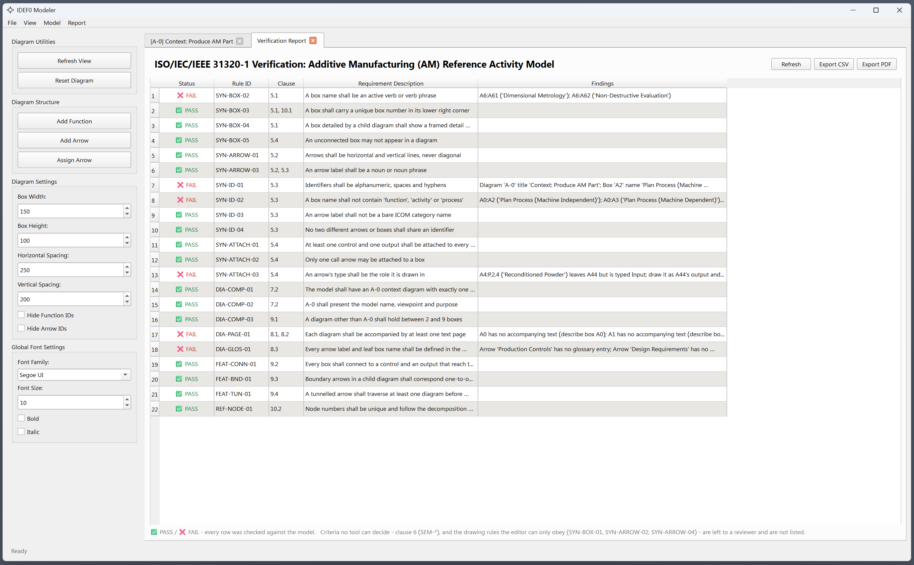
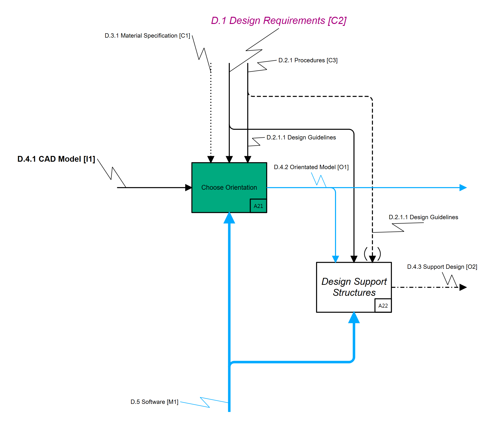

# IDEF0 Modeler
<p align="center">
  
</p>

<p align="center">
  A desktop editor for IDEF0 function models that draws, checks and exports them
  to the conformance rules of <b>ISO/IEC/IEEE 31320-1:2012</b>.
</p>

<p align="center">
  
  
  
  
  
</p>

[](https://doi.org/) [](https://github.com/DuncanWilliamGibbons/IDEF0) [](https://github.com/DuncanWilliamGibbons/IDEF0/blob/main/LICENSE) [](https://github.com/DuncanWilliamGibbons/IDEF0/commits/main)


This software enables users to import, develop, and export Integrated Definition for Function Modeling (IDEF0) models that comply with the ISO/IEC/IEEE 31320-1[^1] standard for functional modeling. The software has an intuitive GUI for the modeler to edit the model and visualize IDEF0 diagrams. 

The IDEF0 modeling language has its roots in the Structured Analysis and Design Technique (SADT). It was developed for the US Air Force and formalized by the NIST FIBS PUB 183 specification in 1993 [^2]. This modeling language and approach are simple and easy to understand by stakeholders, while also enabling the modeling of large and complex functional architectures of systems or enterprises. This can be in the form of software functions, operating processes, or general activities. This language and approach are not as popular as they once were, largely due to the lack of vendor and tool support, model-based and digital formats, and integration or links to other modeling and information formats. This software aims to address these shortcomings by providing a simple GUI to model IDEF0-compliant functional models and architectures, developing an XML-based data format, and the capability to parse the models into other useful formats, such as SysML V2 or JSON files for further development and integrations with other model-based systems engineering (MBSE) tools and systems.

## Table of Contents
- [Description](#tensile-analyzer)
- [Features](#features)
- [Installation and Use](#installation-and-use)
- [Code Structure](#code-structure)
- [Data Formats and Exports](#data-formats-and-exports)
- [Examples and Testing](#examples-and-testing)
- [Limitations and Future Work](#limitations-and-future-work)
- [License and Citation](#citation-and-license)
- [References](#references)
## Features
The IDEF0 program has the following features:
- Import and export IDEF0 models.
- Develop IDEF0-compliant models and diagrams.
- Editorial capabilities, including changing colors, fonts, font sizes, arrow styles, thicknesses, box sizes, and spacings.

- **Full IDEF0 syntax** — function boxes with node numbers and detail references,
  ICOM arrows on all four faces, call arrows, boundary arrows, branches and
  merges with junction dots, tunnelled arrows, and the A-0 context diagram with
  its purpose and viewpoint statements.
- **Hierarchical decomposition** — double-click a box to open or create its child
  diagram; boundary arrows stay reconciled with the parent in both directions.
- **Automatic layout and routing** — diagonal box placement and orthogonal
  (Manhattan) arrow routing, computed from the model on each diagram. Arrow order
  on each box face, label placement and trunk nesting each follow the rule that
  minimises arrow overlapping; see [docs/DESIGN_NOTES.md](docs/DESIGN_NOTES.md).
- **Both ICOM identities** — the code you assign (`P.2`, `D.4.1`) and
  the positional code the standard defines (`C1`, `O2`) live in separate fields.
  **View → ICOM IDs** determines which is drawn.
- **Verification report** — 22 criteria from ISO/IEC/IEEE 31320-1 evaluated
  against the model, each result saying how it was decided. Every row is PASS or
  FAIL; criteria no tool can decide are listed in
  [docs/IDEF0_Validation_Criteria.md](docs/IDEF0_Validation_Criteria.md)
  for a human reviewer.
- **Model database views** — ICOMs and Functions as filterable tables, each with
  an export button that writes what the table currently shows as CSV, JSON, XML, or TXT.
- **Reports** — node tree, node index, and a **flow report per ICOM role**
  listing every diagram that carries one, with the arrows named and counted.
  The flow reports filter, size to their text, and export like the database
  views, and double-clicking a row opens that diagram.
- **Undo, Reset, and Refresh** - Functionality to undo up to 5 changes in the project,
  reset the open diagram back to its initial state, or refresh the open diagram to re-run
  the routing and layout logic. **Model → Automatically Route Arrows** discards manual
  arrow segments, junctions and label offsets so everything is routed afresh.
- **Exports** — seven code and interchange formats (see below), plus diagram export
  to PNG, JPEG, SVG or PDF.
  
## Installation and Use
This software requires Python 3.9 or newer, and was developed and tested on 3.13.

The prerequisite libraries required to run this program are: PyQt6

The following bash commands can be run to clone the repo, install the prerequisites, and run the program to launch the GUI:

```bash
git clone https://github.com/<your-account>/idef0-modeler.git
cd idef0-modeler
pip install -r requirements.txt
```

```bash
python src/main.py
```

The application opens on an empty A-0 context diagram. To see a real model
instead, use **File → Open Project** on one of the models in
[examples/](Example%20Model/):


### A first model

1. **Model → Add Function Box** on the A-0 diagram to create the single context
   box, then name it with a verb phrase.
2. **Model → Add Arrow** to attach its inputs, controls, outputs, and mechanisms.
   The face an arrow attaches to is its role.
3. Double-click the box to decompose it. The parent's boundary arrows arrive on
   the child diagram as stubs to be connected to the child's boxes.
4. **Report → Verification Report (ISO 31320-1)** to see what the model does and
   does not yet satisfy.
5. **File → Save Project** writes a `.idefproj` file — the model with its layout.
   **File → Export IDEF0 Model** writes a `.idef0` file, which is the functional
   content alone with positions and colours stripped.
   
## Code Structure
The codebase is split into two parts: **`src/core/` holds no Qt import**, and `src/gui/`
is where every `PyQt6` import lives. `src/core/` contains the model and its functionality, 
including parsing, layout, routing, conformance checking, and exporting.

```
src/main.py              MainWindow - menus, toolbars, undo history, wires GUI to core
│
├── src/core/             
│   ├── model.py             the data model: IDEF0Model, Diagram, ActivityBox,
│   │                        Arrow, ArrowType, Point
│   ├── layout.py            diagonal box placement, Manhattan arrow routing
│   ├── xml_io.py            model ⇄ .idefproj / .idef0
│   ├── compliance.py        the 22 ISO/IEC/IEEE 31320-1 criteria the report runs
│   ├── export_common.py     resolves the model into an activity tree
│   └── {code,uml,sysml,plantuml,bpmn}_export.py
│                            one file per export target, each just a renderer
│                            of the tree export_common built
│
└── src/gui/              PyQt6 only
    ├── diagram_scene.py     QGraphicsScene subclass - lays out and routes a
    │                        Diagram from src.core.layout, then draws it
    ├── diagram_items.py     the QGraphicsItem subclasses layout draws:
    │                        boxes, arrows, labels, tunnel notation
    ├── management_views.py  ICOMs / Functions / Flow Report tables
    ├── verification_tab.py  runs src.core.compliance and renders the report
    ├── frame_item.py, item_panel.py, properties_panel.py, dialogs.py, theme.py
    │                        frame border, per-item editing panel, settings
    │                        panel, modal dialogs, the dark-mode stylesheet

docs/                     design rationale and export mappings
examples/                 reference models for testing
figures/                  logos and example screenshots
```

## Data Formats and Exports
An XML-based file format was developed to support the import and export of IDEF0 models. This file format is indicated by .idef0 and contains the functions, ICOMs, and editorial details to repeatably generate the IDEF0 model and associated diagrams. 
The program also had functionality to parse IDEF0 functional models into the new SysML V2 format per the OMG Systems Modeling Language™ (SysML®) Version 2.0[^3].

| Command | Writes | Contains |
| :--- | :--- | :--- |
| **File → Save Project** | `.idefproj` | the model **and its drawing** — box positions and sizes, routed arrow segments, junctions, colours, label offsets |
| **File → Open Project** | reads `.idefproj` or `.idef0` | replaces the open project and reopens at A-0 |
| **File → Export IDEF0 Model** | `.idef0` | the model **without the drawing** — boxes, arrows, types, labels, ICOM codes and attachments only |
| **File → Import IDEF0 Model** | reads `.idef0` | as above, then lays the model out automatically |
| **File → Export Diagram** | `.png` `.jpg` `.svg` `.pdf` | the active diagram as a picture |


An `Export` button on the ICOMs database, the Functions database and each Flow
Report writes **the rows currently shown**, filter included, as CSV, JSON, XML
or TXT.

**File → Export Code Architecture** writes the functional architecture as:

| Target | Output | Mapping |
| :--- | :--- | :--- |
| Python | module that runs as it stands | one method per function, signals wired through a per-activity context |
| Java | class that compiles | as above |
| C++ | translation unit that compiles | as above |
| SysML v2 | textual notation | `action def` per function, ICOMs as `in`/`out` item features |
| UML | XMI 2.1 | `uml:Activity` per function, box → `CallBehaviorAction`, arrow → `ObjectFlow` between pins |
| UML | PlantUML activity diagrams | the same mapping, drawn — one page per diagram of the model |
| BPMN | BPMN 2.0 XML | leaf → `bpmn:task`, decomposition → `callActivity`, control/mechanism → `dataObjectReference` |

All seven read the model through `src/core/export_common.py`, which resolves it
once into an activity tree, so they cannot disagree about what the model says.
Every one of them exports the **whole project**, not the diagram in front of
you, and supplies its own extension if you do not type one.

IDEF0 states no sequence, so boxes are laid
out in dependency tiers rather than chained into a false order; and an IDEF0
control is data that governs a function, so it maps to an object flow into a
pin, not to a UML control flow.

## Examples and Testing
The program was demonstrated and tested using the Powder Bed Fusion (PBF) Reference Activity Model published in the NIST AMS 100-60 report[^4].

<p align="center">
  
</p>

<p align="center">
  
</p>

## Limitations and Future Work
- **Call arrows** are held in the model, validated, and
  exported as mechanisms, but are drawn and routed like any other mechanism
  rather than with the dedicated geometry.
- **Semantic criteria cannot be checked.** Whether an output truly accounts for
  its inputs, or a trunk means the union of its legs, asks whether two things
  carry the same meaning. These criteria are left
  to a human reviewer rather than reported on.
- **Glossary and text pages** are not yet editable in the
  application.

## Citation and License
If you adapt or use this software, please refer to the CITATION.cff file for the citation style. This software can be cited as follows:

Gibbons, D. W. (2026). IDEF0 Modeler (Version 0.9.0) [Computer software]. 

MIT License

Copyright (c) 2026 Duncan W. Gibbons, Ph.D.

## References

[^1]: ISO. Information technology — Modeling Languages — Part 1: Syntax and Semantics for IDEF0. ISO/IEC/IEEE 31320-1, 2012.
[^2]: NIST. Integrated Definition for Function Modeling (IDEF0). NIST FIBS PUB 183, 1993.
[^3]: OMG. OMG Systems Modeling Language™ (SysML®) Version 2.0: Part 1: Language Specification. 2025.
[^4]: Gibbons, D. W., & Witherell, P. W. A Reference Activity Model for Additive Manufacturing: Powder Bed Fusion (NIST AMS 100-60). https://doi.org/10.6028/NIST.AMS.100-60. 2024.

